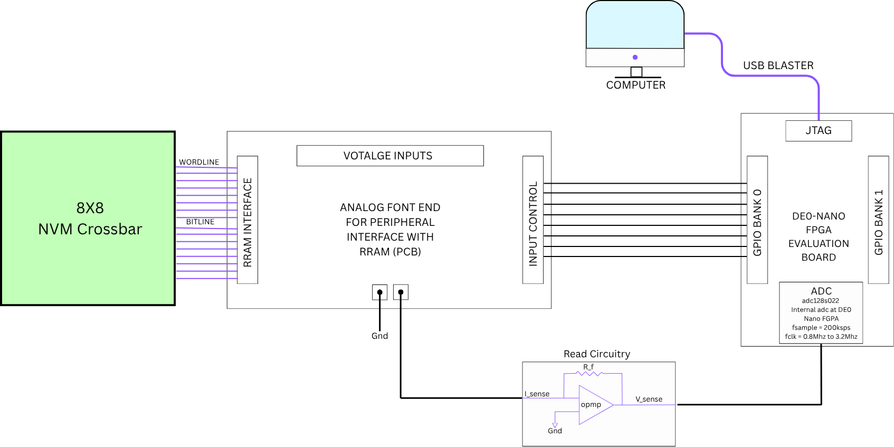
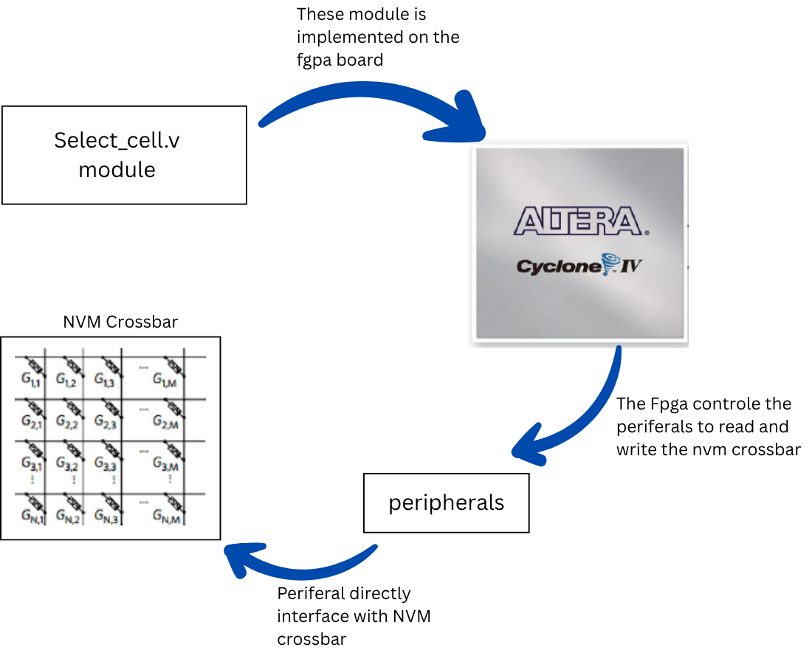
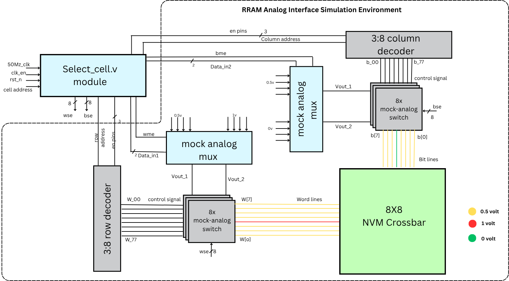
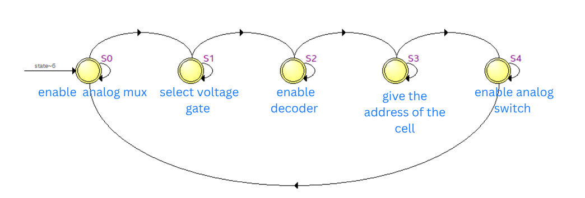
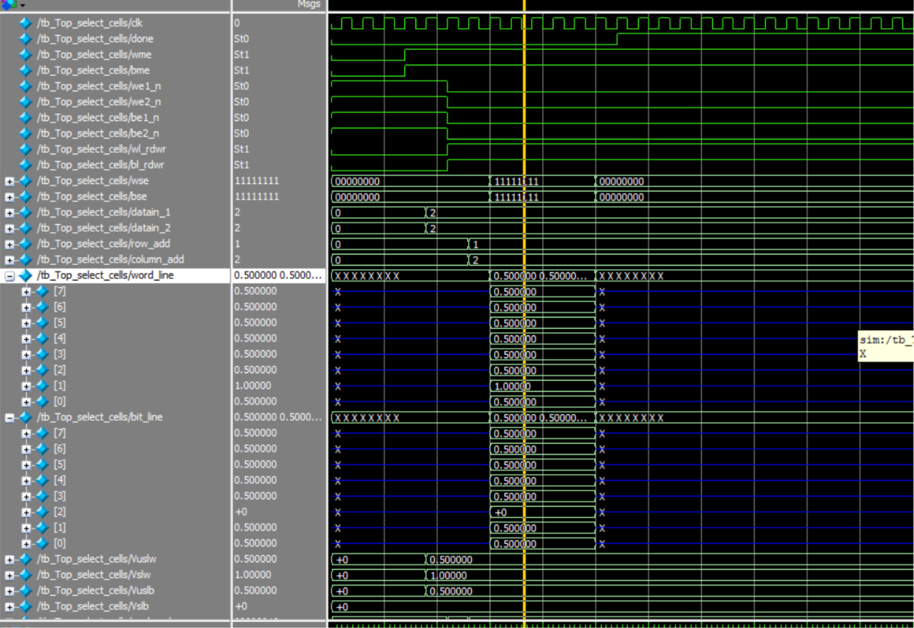
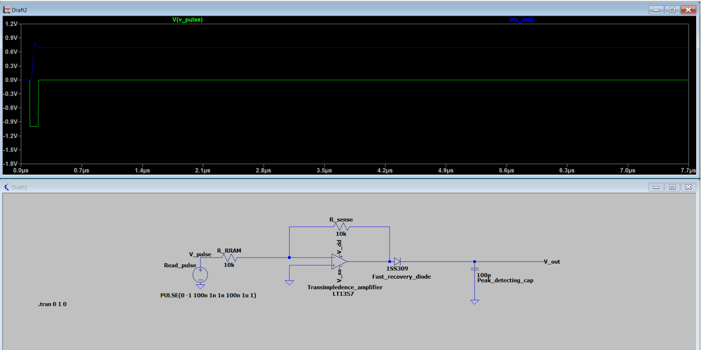

# FPGA-Driven RRAM Crossbar Controller
## Motivation

The rapid growth of machine-learning (ML) and artificial-intelligence (AI) workloads is creating an increasing demand for computing architectures that can provide high throughput while reducing energy and data-movement overhead. In a conventional von Neumann architecture, memory and computation are physically separated. As the amount of data processed by modern workloads increases, this separation leads to repeated movement of data between memory and the processing unit, creating the well-known memory-wall bottleneck. The resulting data-transfer overhead contributes to increased latency and energy consumption.

This motivates a shift from conventional compute-centric architectures toward in-memory computing (IMC) and neuromorphic computing, where memory and computation are brought closer together—or, ideally, performed within the same physical structure.

<table>
  <tr>
    <td align="center">
      
       
      <em> (a) RRAM Crossbar Illlustration </em>
    </td>
    <td align="center">
      
       
      <em>(b) Neural Weights Mapped to RRAM crossbar </em>
    </td>
  </tr>
</table>

## Setup and Architechture 

  

  <em>Overall Setup</em>

This architecture integrates the 8×8 NVM crossbar with an analog front-end PCB and the DE0-Nano FPGA for digital control. The FPGA generates the required control signals, while the analog interface applies the appropriate voltage conditions for cell selection and read/write operations. A dedicated read circuit senses the crossbar output and interfaces it with the FPGA's built-in ADC. The FPGA implements Select Cell module while high level diagram is given below. This will be reponsible for selecting each RRAM cell in the corssbar before read or write. 

  

  <em>High Level Diagram</em>

As this diagram indicates, this project uses Altera Cyclone IV, DE0 Nano FPGA develpomnet board. The select cell is implemented in verilog and tested and implemented in Modelsim. The detail Architechture involving the select Cell module and Analog Front-End for interfacing the NVM corssbar is shown below. 

  

  <em>Select Cell Configuration</em>

For more details of its working and integration please visit the Documentation and Presenation in the Documents Folder in Repo. Apart from this lets now discuss about the wokring of Select Cell module. The Select Cell is implmented through a finite state machine. The State diagarm of the finite State Machine is given below. 

  

  <em>Select Cell Configuration</em>

However, the FSM introduces a **fundamental timing constraint** when the same clock is used for both state transitions and pulse-width generation. To determine the maximum operating frequency, I **derived the following timing relationship from the state-transition and pulse-generation sequence of the FSM**:

$$
f_{\mathrm{clk(max)}} =
\frac{1}{
\max\left(
\frac{t_{\mathrm{on(max\,en)}}+t_{\mathrm{transition}}-t_{\mathrm{on(sw\,en)}}}{3},
\frac{t_{\mathrm{trans2}}+t_{\mathrm{on(sw\,en)}}-t_{\mathrm{off(sw\,en)}}-p_w}{n}
\right)
}
$$

where:

- $n$ is the number of clock cycles used to generate the required pulse width,
- $p_w$ is the required pulse width,
- $t_{\mathrm{on(max\,en)}}$ is the maximum-enable timing,
- $t_{\mathrm{on(sw\,en)}}$ and $t_{\mathrm{off(sw\,en)}}$ represent the switch-enable timing,
- $t_{\mathrm{transition}}$ and $t_{\mathrm{trans2}}$ represent the corresponding FSM transition delays.

This equation was **derived specifically for our FSM implementation** by considering the timing requirements of the individual FSM states, switching delays, and the pulse-generation interval. It provides a direct relationship between the required pulse width, the number of clock cycles allocated to the pulse, and the maximum permissible FSM clock frequency. For our implementation, $n=5$ and $p_w=100~\mathrm{ns}$; substituting these values into the derived timing equation gives $\boxed{f_{\mathrm{clk(max)}}\approx22.73~\mathrm{MHz}}$. Therefore, although the FPGA itself can operate at a substantially higher clock frequency, the **FSM cannot be operated arbitrarily fast while maintaining the required 100 ns pulse width**, since the pulse-generation requirement becomes the limiting timing factor. This exposes a fundamental limitation of using a **single clock domain** for both FSM state transitions and pulse generation: the clock must be sufficiently fast for efficient control sequencing while simultaneously providing adequate timing resolution for the required pulse width. To overcome this limitation, the **final architecture was adjusted by decoupling the FSM clock from the pulse-generation clock**, using a slower clock for the main FSM and a faster clock for precise pulse generation. This allows the required **100 ns selection pulse** to be generated with adequate resolution without unnecessarily limiting the operating frequency of the overall controller.

> **Key Observation:** The derived timing equation shows that the **pulse-generation requirement, rather than the FPGA's intrinsic clock capability, is the limiting factor of the original single-clock FSM architecture.**

> **Final Adjustment:** The controller was therefore modified to use **separate clock domains for FSM control and pulse generation**, providing independent optimization of state-transition timing and pulse-width resolution.

## Result

 

  

  <em>Waveform</em>

 

The above results were simulated in **ModelSim** and accurately demonstrate the required select-voltage configuration for the chosen read operation. The FPGA implementation uses a **PLL-generated dual-clock architecture**, where one clock is dedicated to the main **FSM and control sequencing**, while the second clock is used for the precise generation of the **read/write voltage spikes**. This separation allows the FSM timing and pulse-width generation to be optimized independently, overcoming the limitation identified in the original single-clock architecture. The corresponding **Static Timing Analysis (STA)** confirms that the design satisfies the required timing constraints, with a **setup slack of 8.183 ns**, **hold slack of 0.187 ns**, **recovery slack of 14.084 ns**, **removal slack of 0.577 ns**, and a **minimum pulse width of 9.274 ns**. Since all reported slacks are positive, the implemented design meets the timing requirements at the target **50 MHz FSM clock frequency**. The critical path is identified between `Select_cell:u1|column_add[1]` and `column_add[3]`, with a worst-case slack of **8.183 ns**. The Fmax analysis further reports **84.62 MHz** for the `slow 1200mV 85c` corner and **90.47 MHz** for the `slow 1200mV 0c` corner, both comfortably exceeding the **50 MHz target frequency**. The synthesis results also demonstrate that the controller is highly resource-efficient, utilizing only **26/22,320 logic elements (<1%)** and **49 registers**, with no embedded memory, multipliers, or PLL resources used beyond the required clock-generation infrastructure. The design uses **36 of the 154 available FPGA pins (23%)**, with the I/O standard configured as **3.3-V LVTTL**, a **4 mA drive strength** for standard outputs (8 mA for `done`), and a slow slew-rate configuration. The primary clock is assigned to **PIN R8**, corresponding to the DE0-Nano's internal **50 MHz oscillator**, while the `done` signal is mapped to **LED[0]** for direct hardware observation. Overall, the synthesis, timing, pin-assignment, and resource-utilization results confirm that the proposed FPGA controller is both **timing-compliant and lightweight**. Two clock signals are generated using the **ALTPLL IP**, both derived from the DE0-Nano's original **50 MHz internal clock**: one clock is used for the FSM, while the other is used for generating the read/write pulses.
<table>
  <tr>
    <td align="center">
      
       
      <em>(a) 5 us pulse </em>
    </td>
    <td align="center">
      
       
      <em>(b) 500 us pulse </em>
    </td>
  </tr>
  <tr>
    <td align="center">
      
       
      <em>(c) 50 us pulse </em>
    </td>
    <td align="center">
      
       
      <em>(d) 1 ms pulse </em>
    </td>
  </tr>
</table>

  <em> Generation of read and write pulses of diffrent pulse width </em>

The generated read/write pulses were experimentally evaluated using the DE0 Nano FPGA controller and oscilloscope for different pulse widths and operating frequencies. The measurements show that the controller can generate the required voltage pulses, but the waveform quality becomes increasingly affected at higher frequencies. At **1 MHz with a 5 μs pulse**, the output reaches a peak of approximately **2.2 V**, but exhibits significant ringing, overshoot, and an underdamped response. At **100 kHz with a 50 μs pulse**, the peak voltage remains approximately **2.2 V**, although the waveform exhibits noticeable overshoot and a relatively long settling time. In contrast, at **10 Hz with a 500 μs pulse** and **5 kHz with a 1 ms pulse**, the waveform becomes considerably cleaner, with stable voltage levels and smooth transitions. The measured results are summarized below.

| Frequency | Pulse Width | Observed Voltage | Observation |
|:---------:|:-----------:|:----------------:|:------------|
| 1 MHz | 5 μs | Peak ≈ 2.2 V; average over 0–5 μs ≈ 1.75 V | Severe ringing, overshoot, and underdamped transitions |
| 100 kHz | 50 μs | Peak ≈ 2.2 V; average ≈ 1.44 V over full pulse and ≈ 1.78 V over 24–50 μs | Noticeable overshoot and slow return to baseline |
| 10 Hz | 500 μs | Peak and average ≈ 2.2 V | Cleaner waveform |
| 5 kHz | 1 ms | Peak and average ≈ 2.22 V | Smooth transition |

These measurements identified that the practical performance of the system was mainly limited by the **stability of the voltage during the required hold period and the bandwidth of the read circuitry**. At higher switching frequencies, the output did not settle sufficiently quickly and exhibited ringing and overshoot, making reliable sensing of the read voltage more difficult. The read path was therefore redesigned to improve its transient response and sensing capability. In the redesigned implementation, a **transimpedance amplifier (TIA)** is used to convert the RRAM read current into a measurable voltage, while a **fast-recovery diode** is incorporated to provide faster recovery of the sensing path after the read/write pulse. This redesign improves the ability of the read circuit to respond to short-duration pulses and recover rapidly between successive operations.

> **Key Observation:** The FPGA pulse-generation logic was able to produce the required control pulses; however, the **analog read path and its settling behavior became the dominant limitation at higher frequencies**.

> **Design Adjustment:** To address this limitation, the read circuitry was redesigned using a **transimpedance amplifier and fast-recovery diode**, providing improved current-to-voltage conversion and faster recovery for subsequent read/write operations.

### Redesigned Read Circuit 

 

  

  <em>Improved Read Circuitry</em>

 

The redesigned read circuit was further verified through simulation using a **5 ns read pulse**. As shown in the simulation, the short input pulse is successfully converted by the **transimpedance amplifier (LT1357)** into a voltage response corresponding to the RRAM read current. A small transient is observed at the beginning of the response due to the switching of the read pulse, after which the output settles to a stable voltage level. The **fast-recovery diode (1SS309)** isolates the sensing stage during the recovery interval, while the **100 pF peak-detection capacitor** stores the detected voltage and maintains the output level after the 5 ns pulse has ended. Thus, although the read pulse is only 5 ns wide, the resulting voltage is held for a significantly longer duration, providing sufficient time for the external ADC/memory interface to sample and process the sensed RRAM state.

### Final Experimental Result — 5 ns Read Pulse

The redesigned read circuit was finally tested experimentally with a **5 ns read pulse**. The oscilloscope measurement confirms that the short-duration pulse produces a clear voltage response at the output of the read circuit, demonstrating successful detection of the RRAM read event. The observed waveform shows a sharp transient followed by a gradual discharge of the stored voltage. This discharge was **not observed in the idealized simulation** because the simulation did not include the complete intrinsic and external resistance of the practical circuit. In the experimental setup, these resistances form an effective output resistance through which the **100 pF peak-detection capacitor** gradually discharges. Therefore, the measured decay is primarily attributed to the **effective output impedance of the practical read circuit**, including parasitic and external resistive components, rather than a failure of the pulse-generation or peak-detection mechanism. Nevertheless, the output voltage remains detectable for a sufficient time after the 5 ns pulse, demonstrating that the redesigned read circuit successfully converts the short RRAM read event into a measurable voltage suitable for subsequent ADC sampling.

 

  

  <em>Improved Read Circuitry</em>

 

> **Key Observation:** The final experimental result validates the redesigned read circuit for a **5 ns RRAM read pulse**. The difference between the simulated and measured decay is mainly due to the **intrinsic and external resistances (effective output impedance)** of the practical circuit, which were not included in the idealized simulation.

## Tools, Equipment and Components Used

The following tools, equipment, and major components were used for the design, implementation, and experimental validation of the RRAM controller.

### Hardware and Test Equipment

- **DE0-Nano (Cyclone IV FPGA Evaluation Board)** — used for implementing the Verilog-based digital controller and generating the required control and read/write pulses.
- **Keithley 3-Channel Power Supply** — used to provide the required supply and bias voltages for the RRAM interface and analog circuitry.
- **Tektronix 4 Series Mixed Signal Oscilloscope** — used to observe and characterize the generated voltage pulses and read-circuit response.
- **RRAM Interface PCB** — used to interface the FPGA-controlled analog circuitry with the 8×8 RRAM crossbar.

### Development and Simulation Tools

- **Intel Quartus Prime 20.1.1** — used for Verilog synthesis, FPGA programming, pin assignment, timing analysis, and `ALTPLL` implementation.
- **ModelSim** — used for functional simulation and verification of the FSM-based control logic and voltage-selection sequences.

### Major Components

| Component | Function |
|:---|:---|
| **74HC138** | 3-to-8 line decoder for address decoding |
| **74HC238** | 3-to-8 line decoder used in the selection circuitry |
| **ADG1419** | Analog switch for routing selected voltage levels to the crossbar |
| **ADG1608 / ADG1609** | Analog multiplexer for selecting the required voltage levels |
| **AD795** | Precision operational amplifier used in the analog circuitry |
| **LT1357** | High-speed operational amplifier used as the transimpedance amplifier in the redesigned read circuit |
| **LTC2311-12** | ADC used for digitizing the sensed read voltage |
| **1SS309** | Fast-recovery diode used in the redesigned read circuit |
| **100 pF capacitor** | Peak-detection and voltage-hold element |

The analog interface uses analog multiplexers and switches to select and route the required voltage conditions to the wordlines and bitlines, while the read path converts the RRAM current into a measurable voltage for ADC acquisition. :contentReference[oaicite:0]{index=0}

---

## Conclusion

This project demonstrates the **design, simulation, and hardware implementation of an FPGA-controlled 8×8 RRAM crossbar interface**. The digital controller was implemented in Verilog on the DE0-Nano FPGA using FSM-based control logic, and the required read/write operations were verified through simulation, static timing analysis, and experimental measurements. The implemented controller satisfies the required timing constraints while maintaining low FPGA resource utilization.

The experimental results also identified limitations in the original pulse and read circuitry, particularly at higher operating frequencies where ringing, overshoot, and settling effects became significant. To address the read-path limitation, the circuit was redesigned using a **transimpedance amplifier, fast-recovery diode, and peak-detection capacitor**. The redesigned circuit was successfully demonstrated experimentally with a **5 ns read pulse**, producing a detectable output voltage that remains available for subsequent ADC sampling.

Overall, the developed system provides a functional hardware platform for further exploration of **RRAM-based in-memory and neuromorphic computing**, with future extensions toward operations such as matrix-vector multiplication and MAC computation.

> **Confidentiality Note:** The detailed **PCB design, complete circuit schematic, and associated hardware design files cannot be shared publicly** due to the **NDA and laboratory confidentiality requirements of the IIT-B laboratory** where the hardware development was performed. Therefore, only the **Verilog files implemented (Main Files) during the project internship** are included in this repository. The shared material focuses on the digital controller, its implementation, simulation, timing analysis, and experimentally demonstrated results, while the proprietary PCB and schematic details are intentionally excluded. For more details of the project visit **Docoments**
